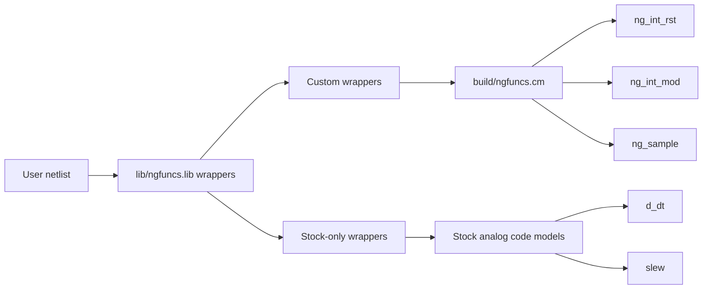
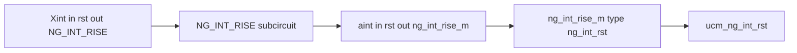
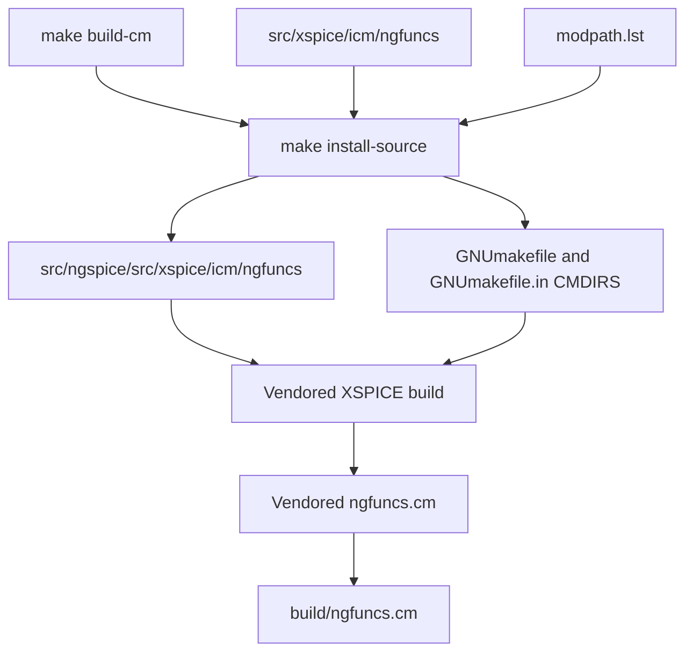

# Architecture

## Project boundary

Project-owned model and wrapper sources are:

- `src/xspice/icm/ngfuncs/`: canonical custom XSPICE source
- `lib/ngfuncs.lib`: public `.subckt` wrappers
- `tests/`: regression and stock smoke decks
- `examples/`: runnable usage decks

`src/ngspice/` is a vendored ngspice 46 source/build tree. Its stock devices,
examples, and Verilog-A files are upstream material, not project-supported
devices.

## Backend architecture

Custom stateful functions use project code models. The derivative and
comparator families compose existing stock ngspice facilities.

## Wrapper expansion

The wrapper fixes internal selector parameters such as `mode` and
`aw_enable`, while exposing the public parameter set.

## Stateful model design

The custom models store transient state through XSPICE analog state vectors.
Edge-sensitive behavior compares the current trigger classification with the
previous accepted timestep, not merely the previous solver call. This avoids
committing trial-timestep edges.

The reset and sample implementations also allocate `STATE_TRIG_RAW`, but the
current code never reads it. It is not part of the active edge-detection path.

## Build flow

The vendored tree supplies generated headers, build rules, and XSPICE support
that are not provided by `cmpp` alone.

## Durable decisions

- [Stateful functions use custom XSPICE models](adr/0001-stateful-functions-use-custom-xspice.md)
- [Public wrappers may compose custom and stock models](adr/0002-public-wrappers-and-stock-composition.md)
- [The project vendors an ngspice build harness](adr/0003-vendored-ngspice-build-harness.md)
