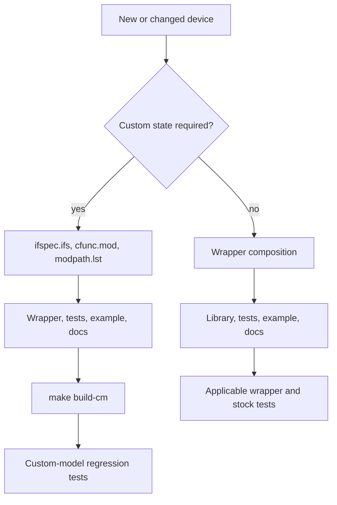

# Development

## Repository layout

| Path | Ownership |
| --- | --- |
| `src/xspice/icm/ngfuncs/` | Canonical custom-model source; edit here |
| `src/ngspice/` | Vendored ngspice 46 build harness and upstream reference |
| `src/ngspice/src/xspice/icm/ngfuncs/` | Generated source copy; do not edit |
| `lib/ngfuncs.lib` | Public wrapper library |
| `examples/` | Runnable usage decks |
| `tests/` | Regression and smoke decks |
| `build/ngfuncs.cm` | Generated runtime artifact |
| `tests/output/` | Generated validation artifacts |

## Normal workflow

After custom model or wrapper changes:

```sh
make build-cm
make test
make check-stock
```

After documentation-only changes, the existing `build/ngfuncs.cm` may be
reused, but all links, diagrams, examples, and tests must still be checked.

## Change workflow



## Generated artifacts

Do not hand-edit generated copies or reports. Recreate them from canonical
sources. `build/ngfuncs.cm` is generated but currently tracked in the
repository. Whether generated runtime artifacts should remain committed is an
open repository policy and build-artifact decision.

## Runtime expectations

The vendored build tree and installed runtime should remain version-aligned.
The current project uses ngspice 46.

Useful checks:

```sh
which ngspice
ngspice -v
which cmpp
```
