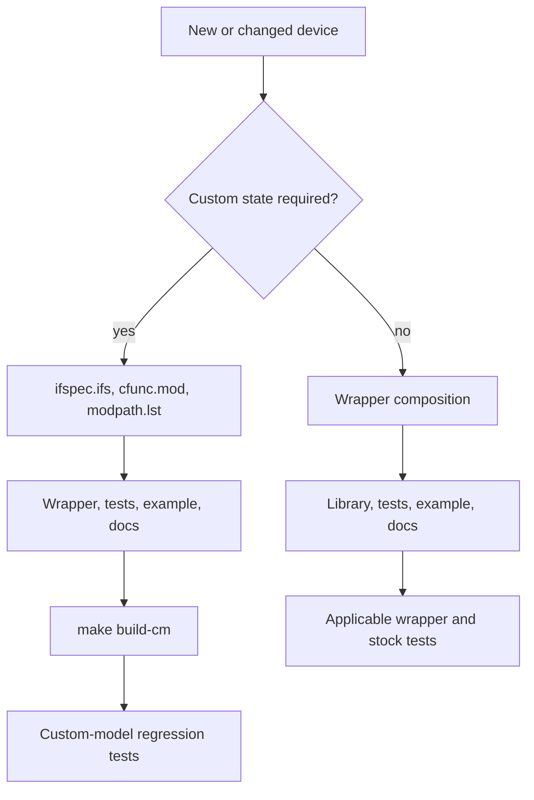

# Development

## Repository layout

| Path | Ownership |
| --- | --- |
| `src/xspice/icm/ngfuncs/` | Canonical custom-model source; edit here |
| `src/ngspice/` | Vendored ngspice 46 build harness and upstream reference |
| `src/ngspice/src/xspice/icm/ngfuncs/` | Generated source copy; do not edit |
| `lib/ngfuncs.lib` | Public wrapper library |
| `examples/` | Runnable usage decks |
| `tests/` | Regression and smoke decks |
| `build/ngfuncs.cm` | Generated runtime artifact |
| `tests/output/` | Generated validation artifacts |

## Normal workflow

Build the custom code-model library from the canonical source with:

```sh
make build-cm
```

This copies `src/xspice/icm/ngfuncs/` into the vendored ngspice XSPICE
code-model tree and writes the runtime library to `build/ngfuncs.cm`.

After custom model or wrapper changes, run:

```sh
make build-cm
make test
make check-stock
```

`make test` runs the custom-model regression suite through the generated or
prebuilt `build/ngfuncs.cm` and writes the HTML report under `tests/output/`.
`make check-stock` runs smoke tests for wrappers that should work with stock
ngspice and `lib/ngfuncs.lib` only.

After documentation-only changes, the existing `build/ngfuncs.cm` may be
reused, but all links, diagrams, examples, and tests must still be checked.

Useful validation commands:

```sh
make test
make check-stock
make test-report
```

## Change workflow



## Generated artifacts

Do not hand-edit generated copies or reports. Recreate them from canonical
sources. `build/ngfuncs.cm` is generated but currently tracked in the
repository. Whether generated runtime artifacts should remain committed is an
open repository policy and build-artifact decision.

## Vendored ngspice build harness

`src/ngspice/` is a vendored ngspice 46 source tree used as the current build
harness for custom XSPICE code models. The project keeps it in-tree so local
builds can use ngspice's own `cmpp` and XSPICE build layout without requiring a
separate checkout.

Canonical project model source still lives under `src/xspice/icm/ngfuncs/`.
The copy under `src/ngspice/src/xspice/icm/ngfuncs/` is generated by
`make install-source` or `make build-cm` and must not be edited directly.

Future repository options:

- Keep the vendored source tree for reproducible local builds.
- Convert ngspice to a git submodule so upstream provenance is explicit.
- Download a pinned ngspice tarball during the build and populate the harness
  from that archive.

No submodule migration is performed in this commit.

## Runtime expectations

The vendored build tree and installed runtime should remain version-aligned.
The current project uses ngspice 46.

Useful checks:

```sh
which ngspice
ngspice -v
which cmpp
```
