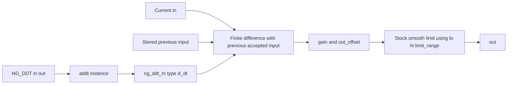

# Derivative

## Device, purpose, and status

`NG_DDT` is a stable wrapper around ngspice's stock XSPICE `d_dt` model. It
does not add code to `ngfuncs.cm`.

## Source

- Wrapper: [`lib/ngfuncs.lib`](../../lib/ngfuncs.lib)
- Stock interface:
  [`d_dt/ifspec.ifs`](../../src/ngspice/src/xspice/icm/analog/d_dt/ifspec.ifs)
- Stock behavior:
  [`d_dt/cfunc.mod`](../../src/ngspice/src/xspice/icm/analog/d_dt/cfunc.mod)

## ngspice usage

```spice
Xddt in out NG_DDT params: gain=1 out_offset=0
```

Only `lib/ngfuncs.lib` is required.

## Pin order

```text
in out
```

## Parameters

| Parameter | Units | Default | Enforcement | Notes |
| --- | --- | --- | --- | --- |
| `gain` | output units per input unit/second | `1` | none | Derivative multiplier |
| `out_offset` | output units | `0` | none | Added after time zero in transient analysis |
| `lo` | output units | `-1e12` | none | Wrapper-supplied lower limit |
| `hi` | output units | `1e12` | none | Wrapper-supplied upper limit |
| `limit_range` | output units | `1e-9` | none | Stock smooth-corner range near limits |

## Model behavior

After the initial transient point:

```text
out = gain * (current_input - previous_accepted_input) / delta_time
      + out_offset
```

The stock model applies smooth limiting near `lo` and `hi`. At time zero and
in DC analysis, the raw derivative output is zero before limit processing;
`out_offset` is not added. In AC analysis, gain is `j * angular_frequency *
gain`; offset and limits do not participate.

## Structure



## Example

[`examples/modulo_and_sample.cir`](../../examples/modulo_and_sample.cir)

## Validation

- Direct wrapper regression:
  [`test_derivative.cir`](../../tests/test_derivative.cir)
- Raw stock-model smoke test:
  [`stock_ddt_smoke.cir`](../../tests/stock_ddt_smoke.cir)

## Limitations

- Output depends on accepted transient timestep spacing.
- `out_offset`, limit smoothing, negative gain, and AC behavior lack focused
  wrapper validation.
- Automatic timestep-refinement behavior in the stock model is
  `NEEDS_VERIFICATION`.
