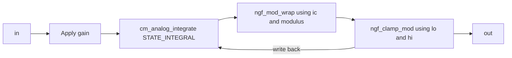

# Modulo integrator

## Device, purpose, and status

`NG_INT_MOD` is a stable custom XSPICE behavioral block that integrates an
input and normalizes the state into a configured modulo interval.

## Source

- Wrapper: [`lib/ngfuncs.lib`](../../lib/ngfuncs.lib)
- Interface: [`ng_int_mod/ifspec.ifs`](../../src/xspice/icm/ngfuncs/ng_int_mod/ifspec.ifs)
- Behavior: [`ng_int_mod/cfunc.mod`](../../src/xspice/icm/ngfuncs/ng_int_mod/cfunc.mod)

## ngspice usage

```spice
Xphase in phase NG_INT_MOD params: ic=0 gain=1 modulus=1
```

The wrapper requires `build/ngfuncs.cm`.

## Pin order

```text
in out
```

| Pin | Direction | Meaning |
| --- | --- | --- |
| `in` | input | Voltage multiplied by `gain` and integrated |
| `out` | output | Wrapped and clamped state |

## Parameters

| Parameter | Units | Default | Enforcement | Notes |
| --- | --- | --- | --- | --- |
| `ic` | output units | `0` | none | Origin of the modulo interval and initial state |
| `gain` | output units per volt-second | `1` | none | Input multiplier |
| `modulus` | output units | `1` | XSPICE declares `>=1e-30` | Width of modulo interval |
| `lo` | output units | `-1e12` | none | Hard lower clamp after wrapping |
| `hi` | output units | `1e12` | none | Hard upper clamp after wrapping |
| `limit_range` | output units | `1e-9` | XSPICE declares `>=0` | Accepted but unused by implementation |

## Model behavior

At time zero or outside transient analysis, the model initializes internal
state to `ic`, outputs `hard_clamp(ic, lo, hi)`, and sets the input partial to
zero. The output clamp does not overwrite internal state on this path; state
remains initialized to `ic`.

This differs from the resettable integrators, whose initialization and reset
paths output `ic` directly without applying `lo` or `hi`.

After integrating, the model computes:

```text
relative = state - ic
wrapped = fmod(relative, modulus)
if wrapped < 0:
    wrapped = wrapped + modulus
value = ic + wrapped
value = hard_clamp(value, lo, hi)
state = value
```

The pre-clamp wrapped interval is `[ic, ic + modulus)`. Wrapping is
bidirectional and preserves the remainder; it is not generally a reset exactly
to `ic`.

## Structure and signal flow



## Example

[`examples/modulo_and_sample.cir`](../../examples/modulo_and_sample.cir)

## Validation

[`tests/test_integrator_modulo.cir`](../../tests/test_integrator_modulo.cir)
validates repeated positive-direction wrapping near zero.

## Limitations

- Negative input, nonzero `ic`, multi-modulus overshoot, and clamp interaction
  need direct validation.
- `limit_range` has no effect.
- `lo <= hi` is not enforced.
- The integration partial may remain nonzero after wrapping or hard clamping;
  numerical consequences are `NEEDS_VERIFICATION`.
