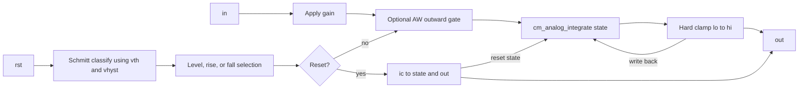

# Resettable integrators

## Purpose and status

These wrappers integrate `gain * V(in)` and add level- or edge-controlled
reset. All use the custom `ng_int_rst` XSPICE model.

| Device | Reset selection | Rail gating | Status |
| --- | --- | --- | --- |
| `NG_INT_PULSE` | while reset is high | disabled | stable |
| `NG_INT_RISE` | low-to-high transition | disabled | stable |
| `NG_INT_FALL` | high-to-low transition | disabled | stable |
| `NG_INT_AW_PULSE` | while reset is high | enabled | stable |
| `NG_INT_AW_RISE` | low-to-high transition | enabled | stable |
| `NG_INT_AW_FALL` | high-to-low transition | enabled | stable |

## Source

- Public wrappers: [`lib/ngfuncs.lib`](../../lib/ngfuncs.lib)
- Interface: [`ng_int_rst/ifspec.ifs`](../../src/xspice/icm/ngfuncs/ng_int_rst/ifspec.ifs)
- Behavior: [`ng_int_rst/cfunc.mod`](../../src/xspice/icm/ngfuncs/ng_int_rst/cfunc.mod)

## ngspice usage

```spice
X1 in rst out NG_INT_RISE params: ic=0 gain=1 vth=0.5
```

These wrappers require `build/ngfuncs.cm` to be loaded before circuit parsing.

## Pin order

All six wrappers use:

```text
in rst out
```

| Pin | Direction | Meaning |
| --- | --- | --- |
| `in` | input | Voltage multiplied by `gain` and integrated |
| `rst` | input | Analog reset/edge-detection voltage |
| `out` | output | Stored integral or reset value |

## Parameters

| Parameter | Units | Default | Enforcement | Notes |
| --- | --- | --- | --- | --- |
| `ic` | output units | `0` | none | Initial and reset output value |
| `gain` | output units per volt-second | `1` | none | Multiplies `V(in)` before integration |
| `vth` | V | `0.5` | none | Center of trigger thresholds |
| `vhyst` | V | `0` | XSPICE declares `>=0` | Full threshold separation |
| `lo` | output units | `-1e12` | none | Hard lower clamp during normal integration |
| `hi` | output units | `1e12` | none | Hard upper clamp during normal integration |
| `limit_range` | output units | `1e-9` | XSPICE declares `>=0` | Accepted but currently unused by `cfunc.mod` |

`lo <= hi` and `ic` placement are not enforced. Reset and time-zero output use
`ic` directly, even when it is outside `[lo, hi]`.

## Model behavior

During transient integration:

```text
state = state + integral(gain * V(in) dt)
out = hard_clamp(state, lo, hi)
state = out
```

Trigger classification is state-dependent:

- low-to-high: `V(rst) >= vth + vhyst/2`
- high-to-low: `V(rst) <= vth - vhyst/2`

At time zero, trigger state initializes without generating an edge. With
`vhyst=0`, exact-threshold behavior is `NEEDS_VERIFICATION` because the helper
uses different equality tests when entering and remaining high.

The so-called anti-windup variants additionally set the post-gain integrand to
zero when the stored state is already at `hi` and input drives upward, or at
`lo` and input drives downward. Ordinary variants also write the clamped output
back to state, so documentation must not imply that only AW variants avoid
hidden state beyond a rail.

## Structure and signal flow



`limit_range` is intentionally absent because it is not read by the current
implementation. `STATE_TRIG_RAW` is also omitted because it is written but not
used by edge detection.

## Examples

- [`examples/resettable_integrator.cir`](../../examples/resettable_integrator.cir)
- [`examples/anti_windup.cir`](../../examples/anti_windup.cir)

## Validation

- Level reset: [`test_integrator_reset_pulse.cir`](../../tests/test_integrator_reset_pulse.cir)
- Rising reset: [`test_integrator_reset_rise.cir`](../../tests/test_integrator_reset_rise.cir)
- Falling reset: [`test_integrator_reset_fall.cir`](../../tests/test_integrator_reset_fall.cir)
- AW level reset and rail recovery:
  [`test_integrator_antiwindup_pulse.cir`](../../tests/test_integrator_antiwindup_pulse.cir)
- AW rising-edge reset and rail recovery:
  [`test_integrator_antiwindup_rise.cir`](../../tests/test_integrator_antiwindup_rise.cir)
- AW falling-edge reset and rail recovery:
  [`test_integrator_antiwindup_fall.cir`](../../tests/test_integrator_antiwindup_fall.cir)

## Limitations

- Custom clamps are hard; `limit_range` does not smooth them.
- The integration partial may remain nonzero after hard clamping. Numerical
  consequences are `NEEDS_VERIFICATION`.
- Trigger crossings create no explicit breakpoints; timestep selection can miss
  narrow pulses.
- Nonzero hysteresis, initial-high triggers, custom thresholds, negative gain,
  and `ic` outside limits lack focused validation.
