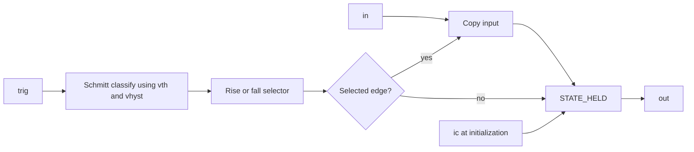

# Sample-and-hold

## Purpose and status

| Device | Selected edge | Status |
| --- | --- | --- |
| `NG_SAMPLE_RISE` | low-to-high trigger transition | stable |
| `NG_SAMPLE_FALL` | high-to-low trigger transition | stable |

Both wrappers use the custom `ng_sample` XSPICE model.

## Source

- Wrappers: [`lib/ngfuncs.lib`](../../lib/ngfuncs.lib)
- Interface: [`ng_sample/ifspec.ifs`](../../src/xspice/icm/ngfuncs/ng_sample/ifspec.ifs)
- Behavior: [`ng_sample/cfunc.mod`](../../src/xspice/icm/ngfuncs/ng_sample/cfunc.mod)

## ngspice usage

```spice
Xsamp signal clk held NG_SAMPLE_RISE params: ic=0 vth=0.5
```

These wrappers require `build/ngfuncs.cm`.

## Pin order

```text
in trig out
```

| Pin | Direction | Meaning |
| --- | --- | --- |
| `in` | input | Voltage copied on the selected edge |
| `trig` | input | Analog edge-detection voltage |
| `out` | output | Held value |

## Parameters

| Parameter | Units | Default | Enforcement | Notes |
| --- | --- | --- | --- | --- |
| `ic` | V | `0` | none | Held value before the first selected edge |
| `vth` | V | `0.5` | none | Center of trigger thresholds |
| `vhyst` | V | `0` | XSPICE declares `>=0` | Full threshold separation |

## Model behavior

Held state starts at `ic`. On the selected accepted-timestep transition, the
model copies `V(in)` into held state. Between selected edges, held state does
not change.

Trigger transitions use:

- rising: `V(trig) >= vth + vhyst/2`
- falling: `V(trig) <= vth - vhyst/2`

No edge action occurs at time zero. If the trigger starts high,
`NG_SAMPLE_RISE` waits for a later low-to-high transition, while
`NG_SAMPLE_FALL` can act on the first later high-to-low transition.

## Structure and signal flow



## Example

[`examples/modulo_and_sample.cir`](../../examples/modulo_and_sample.cir)

## Validation

- [`test_sample_rise.cir`](../../tests/test_sample_rise.cir)
- [`test_sample_fall.cir`](../../tests/test_sample_fall.cir)

## Limitations

- Exact-threshold behavior with `vhyst=0` is `NEEDS_VERIFICATION`.
- Nonzero hysteresis and initial-high trigger behavior lack focused tests.
- Trigger crossings schedule no breakpoints and can be missed by coarse
  timestep selection.
- The model reports zero small-signal partials for input and trigger.
