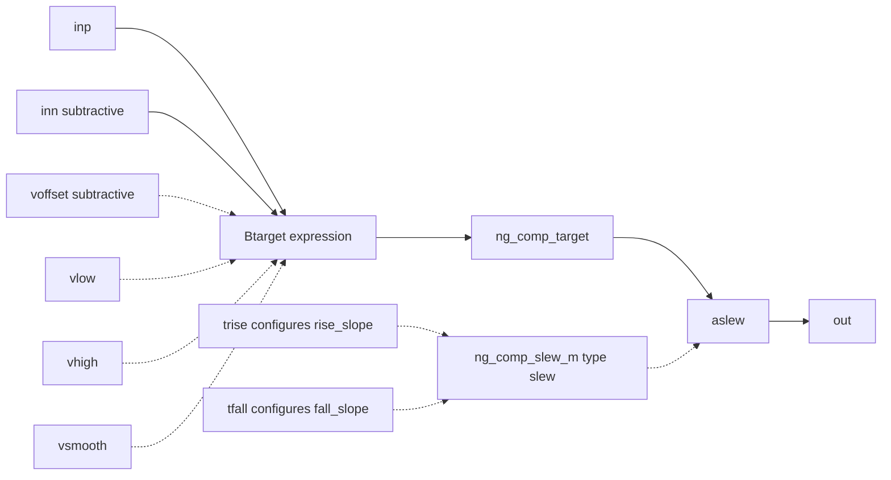
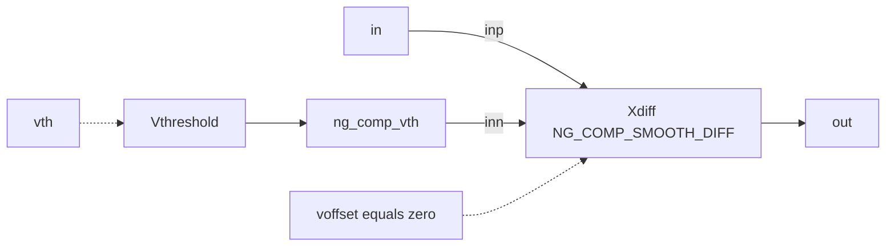

# Smooth analog comparators

## Purpose and status

| Device | Interface | Status |
| --- | --- | --- |
| `NG_COMP_SMOOTH_DIFF` | Differential analog comparator | stable |
| `NG_COMP_SMOOTH_SE` | Single-ended threshold comparator | stable |

Both wrappers produce continuous analog voltages. A behavioral `tanh`
expression creates a smooth target, and stock XSPICE `slew` limits subsequent
output movement. Neither wrapper requires `ngfuncs.cm`.

## Source

- Wrappers: [`lib/ngfuncs.lib`](../../lib/ngfuncs.lib)
- Stock slew interface:
  [`slew/ifspec.ifs`](../../src/ngspice/src/xspice/icm/analog/slew/ifspec.ifs)
- Stock slew behavior:
  [`slew/cfunc.mod`](../../src/ngspice/src/xspice/icm/analog/slew/cfunc.mod)

## ngspice usage

```spice
Xdiff inp inn out NG_COMP_SMOOTH_DIFF params:
+ vlow=0 vhigh=1 voffset=0 vsmooth=1m trise=10n tfall=20n

Xse in detected NG_COMP_SMOOTH_SE params:
+ vth=1.25 vlow=0 vhigh=1 vsmooth=1m trise=80u tfall=200u
```

## Pin order

| Device | Exact pins |
| --- | --- |
| `NG_COMP_SMOOTH_DIFF` | `inp inn out` |
| `NG_COMP_SMOOTH_SE` | `in out` |

## Parameters

| Parameter | Device | Units | Default | Enforcement | Meaning |
| --- | --- | --- | --- | --- | --- |
| `vlow` | both | V | `0` | none | Low target rail |
| `vhigh` | both | V | `1` | none | High target rail |
| `voffset` | differential | V | `0` | none | Subtracted from differential input |
| `vth` | single-ended | V | `0` | none | Internal threshold reference |
| `vsmooth` | both | V | `1m` | none | Static 10% to 90% input width |
| `trise` | both | s | `1n` | none | Full-span target 10% to 90% rise time |
| `tfall` | both | s | `1n` | none | Full-span target 90% to 10% fall time |

Supported caller conditions are `vsmooth>0`, `trise>0`, `tfall>0`, and
`vhigh>vlow`. The wrappers and stock `slew` interface do not enforce them.
Invalid combinations are `NEEDS_VERIFICATION`.

## Differential behavior

```text
vdiff = V(inp) - V(inn) - voffset
target = vlow + (vhigh-vlow)/2
         * (1 + tanh(2.197224577 * vdiff / vsmooth))
```

`vdiff=-vsmooth/2`, `0`, and `+vsmooth/2` produce 10%, 50%, and 90% of
the configured output span.

The wrapper configures stock slew rates as:

```text
rise_slope = 0.8 * (vhigh-vlow) / trise
fall_slope = 0.8 * (vhigh-vlow) / tfall
```

Configured times correspond to output 10% to 90% movement only when the target
makes a sufficiently fast full-span transition. During DC and at time zero,
stock `slew` initializes output directly to target. Slew limiting applies to
later transient changes.

## Differential structure and signal flow



Solid edges are voltage paths; dotted edges configure expressions or models.

## Single-ended structure and signal flow



The effective differential input is `V(in) - vth`.

## Examples

- Differential PWM:
  [`examples/smooth_pwm.cir`](../../examples/smooth_pwm.cir)
- Single-ended threshold:
  [`examples/smooth_threshold.cir`](../../examples/smooth_threshold.cir)

## Validation

- Static transfer and offset:
  [`test_comparator_transfer.cir`](../../tests/test_comparator_transfer.cir)
- Asymmetric slew:
  [`test_comparator_dynamic.cir`](../../tests/test_comparator_dynamic.cir)
- PWM crossings:
  [`test_comparator_pwm.cir`](../../tests/test_comparator_pwm.cir)
- Single-ended equivalence:
  [`test_comparator_single_ended.cir`](../../tests/test_comparator_single_ended.cir)
- Stock-only smoke:
  [`stock_comparator_smoke.cir`](../../tests/stock_comparator_smoke.cir)

## Limitations

- No propagation-delay parameter
- No hysteresis or static-transfer memory
- Analog output only; not an XSPICE digital node
- Small smoothing widths or transition times require tighter timestep control
- Invalid parameters are not checked, and invalid combinations lack focused
  validation.
