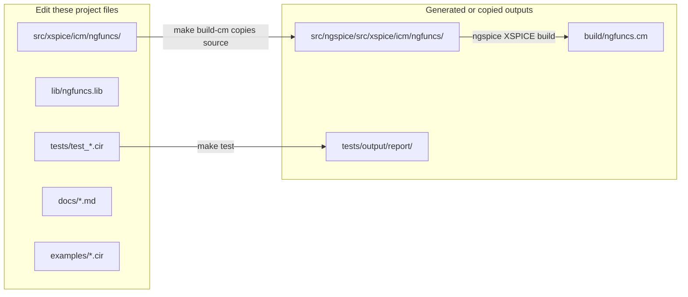
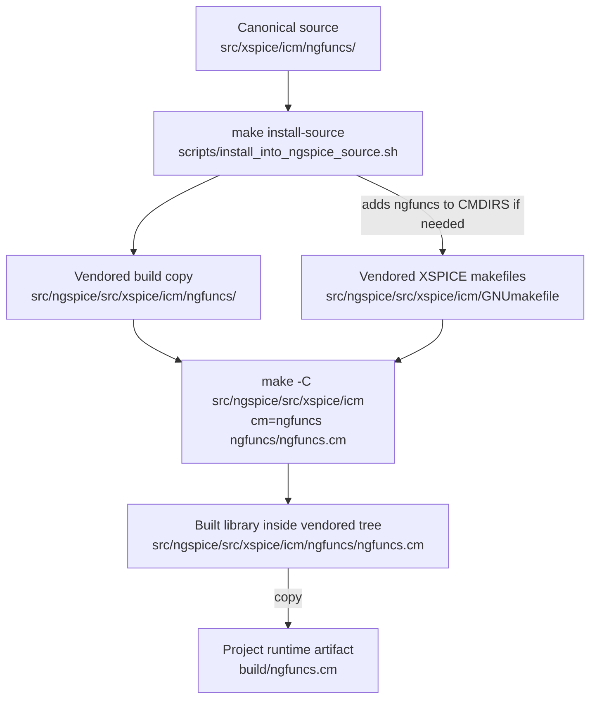
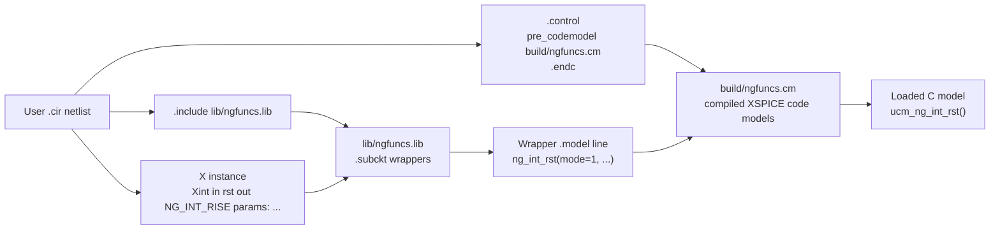
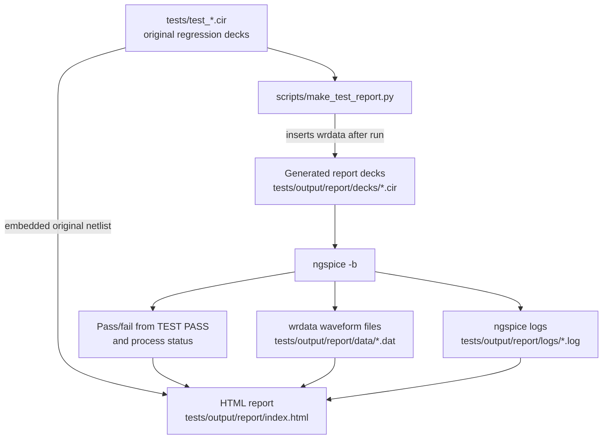

# Project Guide

This document is for future work on this repository. It explains why the
project exists, which files matter, how the build works, and how to check that
changes did not break the ngspice function blocks.

## Purpose

ngspice has useful transient primitives, but its arbitrary sources do not offer
the same convenient LTspice-style stateful functions such as resettable
integration, modulo integration, edge-triggered sample-and-hold, or an
easy-to-package function-block interface.

This project fills that gap with:

- custom XSPICE code models for stateful transient behavior
- `.subckt` wrappers that make those models easy to instantiate from ngspice
  decks
- examples, regression tests, and an HTML waveform report
- a vendored ngspice-46 source/build tree so `ngfuncs.cm` can be rebuilt later

The generated library is `build/ngfuncs.cm`. User netlists load it with
`pre_codemodel`, then include `lib/ngfuncs.lib`.

## Current Device Set

User-facing wrappers live in `lib/ngfuncs.lib`.

| Wrapper | Purpose | Backing model |
| --- | --- | --- |
| `NG_INT_PULSE` | Integrator reset while reset pin is high | `ng_int_rst(mode=0, aw_enable=false)` |
| `NG_INT_RISE` | Integrator reset on reset rising edge | `ng_int_rst(mode=1, aw_enable=false)` |
| `NG_INT_FALL` | Integrator reset on reset falling edge | `ng_int_rst(mode=2, aw_enable=false)` |
| `NG_INT_AW_PULSE` | Anti-windup integrator reset while reset pin is high | `ng_int_rst(mode=0, aw_enable=true)` |
| `NG_INT_AW_RISE` | Anti-windup integrator reset on reset rising edge | `ng_int_rst(mode=1, aw_enable=true)` |
| `NG_INT_AW_FALL` | Anti-windup integrator reset on reset falling edge | `ng_int_rst(mode=2, aw_enable=true)` |
| `NG_INT_MOD` | Modulo/wrapping integrator | `ng_int_mod` |
| `NG_SAMPLE_RISE` | Sample-and-hold on trigger rising edge | `ng_sample(edge=1)` |
| `NG_SAMPLE_FALL` | Sample-and-hold on trigger falling edge | `ng_sample(edge=2)` |
| `NG_DDT` | Derivative block wrapper | ngspice built-in `d_dt` |

The detailed user reference is in `docs/devices.md`.

## Repository Layout

Important project-owned files:

| Path | Meaning |
| --- | --- |
| `src/xspice/icm/ngfuncs/` | Canonical custom XSPICE source for this project. Edit this copy. |
| `src/xspice/icm/ngfuncs/modpath.lst` | Lists the custom model directories included in the `ngfuncs` library. |
| `src/xspice/icm/ngfuncs/ng_int_rst/` | Resettable integrator and anti-windup integrator implementation. |
| `src/xspice/icm/ngfuncs/ng_int_mod/` | Modulo integrator implementation. |
| `src/xspice/icm/ngfuncs/ng_sample/` | Sample-and-hold implementation. |
| `lib/ngfuncs.lib` | User-facing ngspice `.subckt` wrappers. |
| `examples/` | Small runnable netlists for manual exploration. |
| `tests/test_*.cir` | Regression decks used by `make test`. |
| `tests/stock_ddt_smoke.cir` | Smoke test that only needs stock ngspice. |
| `scripts/install_into_ngspice_source.sh` | Copies canonical model source into the vendored ngspice build tree. |
| `scripts/make_test_report.py` | Runs regression decks and writes the HTML waveform report. |
| `scripts/project-git.sh` | Git helper for this workspace's alternate Git directory. |
| `docs/design.md` | Lower-level design notes for model behavior. |
| `docs/devices.md` | User device reference and examples. |

Vendored/generated paths:

| Path | Meaning |
| --- | --- |
| `src/ngspice/` | Vendored ngspice-46 source/build tree used as the XSPICE build harness. |
| `src/ngspice/src/xspice/icm/ngfuncs/` | Generated copy of the canonical model source after `make build-cm`. Do not edit this copy. |
| `build/ngfuncs.cm` | Generated loadable code-model library. |
| `tests/output/report/index.html` | Generated test report. |
| `tests/output/report/data/*.dat` | Generated waveform data from `wrdata`. |
| `tests/output/report/logs/*.log` | Generated ngspice logs for each regression deck. |

Ownership map:



## Build Model

The hard dependency is the XSPICE code-model build harness. Ubuntu packages may
install ngspice and prebuilt `.cm` libraries, but not necessarily the complete
custom code-model build flow. This project therefore keeps the ngspice-46
source/build tree in `src/ngspice`.

The normal build is:

```sh
make build-cm
```

That target does three things:

1. Copies `src/xspice/icm/ngfuncs/` into
   `src/ngspice/src/xspice/icm/ngfuncs/`.
2. Ensures the vendored XSPICE `icm` makefiles include `ngfuncs` in `CMDIRS`.
3. Runs the ngspice XSPICE build target and copies the resulting library to
   `build/ngfuncs.cm`.

Build workflow:



The Makefile is shaped this way because `ngfuncs.cm` is not built by compiling
the project folder alone. Dynamic XSPICE code models depend on ngspice's own
source-tree build harness: generated headers, makefile fragments, model lists,
and code-model build rules. `make build-cm` therefore copies the canonical
project source into the vendored ngspice tree, invokes that XSPICE build
harness, then copies the final `.cm` back to `build/` where user netlists and
tests can load it.

Simulation uses the installed ngspice executable on `PATH`, currently expected
to be `/home/chaiwichit-sura/.local/bin/ngspice`. Check with:

```sh
which ngspice
ngspice -v
which cmpp
```

The expected runtime version is ngspice 46. Keep the runtime and vendored source
version aligned when possible.

## Netlist Load Flow

A user netlist needs both the compiled `.cm` library and the `.lib` wrapper
file. The `.cm` file registers the code models with ngspice. The `.lib` file
defines convenient subcircuits that instantiate those models.



## Normal Workflow

After changing C model code or wrapper definitions:

```sh
make build-cm
make test
make check-stock
```

After changing only docs or report generation:

```sh
make test
make check-stock
```

`make test` writes:

```text
tests/output/report/index.html
```

Open that file in a browser to inspect pass/fail status, measurements, waveform
plots, generated report decks, raw data, and ngspice logs.

## Test Strategy

Regression decks are intentionally split by device/behavior so report sections
are easy to inspect:

| Deck | Coverage |
| --- | --- |
| `tests/test_integrator_reset_pulse.cir` | Level-sensitive reset with repeated reset pulses. |
| `tests/test_integrator_reset_rise.cir` | Rising-edge reset with repeated reset pulses. |
| `tests/test_integrator_reset_fall.cir` | Falling-edge reset with repeated reset pulses. |
| `tests/test_integrator_modulo.cir` | Modulo wrap back to `ic`. |
| `tests/test_sample_rise.cir` | Repeated rising-edge samples. |
| `tests/test_sample_fall.cir` | Repeated falling-edge samples. |
| `tests/test_integrator_antiwindup_pulse.cir` | High clamp, input reversal, pulse reset to `ic`, low clamp, second reversal. |
| `tests/test_derivative.cir` | Two derivative devices: normal ramp input and extreme pulse input. |

The report generator instruments each original deck by inserting:

```spice
set wr_singlescale
set wr_vecnames
wrdata tests/output/report/data/<test>.dat ...
```

The original source netlist is embedded in the HTML report for reference.

Test report workflow:



## Implementation Notes

The three custom XSPICE models share several important rules:

- They must not call `cm_analog_integrate()` outside transient analysis.
- On `INIT`, they allocate state and set initial outputs.
- At `TIME == 0.0` or non-transient analysis, they return the stored initial
  state and zero partials.
- Edge-sensitive behavior uses accepted-state memory via
  `cm_analog_get_ptr(tag, 1)`, because ngspice can call a model repeatedly while
  evaluating or rejecting a timestep.

`ng_int_rst`:

- Stores input state, integral state, current trigger-high state, and raw
  trigger.
- `mode=0` is level-sensitive reset.
- `mode=1` resets on low-to-high transition.
- `mode=2` resets on high-to-low transition.
- When `aw_enable=true`, integration pauses at `hi` if input is positive and
  at `lo` if input is negative. If the input reverses, integration resumes.

`ng_int_mod`:

- Integrates `gain * V(in)`.
- Wraps the internal state to `ic + fmod(state - ic, modulus)`.
- Clamps the wrapped value between `lo` and `hi`.

`ng_sample`:

- Holds `ic` until the first selected trigger edge.
- Copies `V(in)` into held state on the selected edge.
- Outputs held state between edges.

`NG_DDT` is not custom C code. It is a wrapper around ngspice's built-in
XSPICE `d_dt` model.

## Adding or Changing a Device

For a new custom XSPICE model:

1. Add a new directory under `src/xspice/icm/ngfuncs/<model_name>/`.
2. Add `ifspec.ifs` and `cfunc.mod`.
3. Add the directory name to `src/xspice/icm/ngfuncs/modpath.lst`.
4. Add a wrapper subcircuit to `lib/ngfuncs.lib`.
5. Add one or more focused `tests/test_*.cir` regression decks.
6. Run `make build-cm`, then `make test`.
7. Update `docs/devices.md` and this guide if the user-facing behavior changes.

For a wrapper-only change:

1. Edit `lib/ngfuncs.lib`.
2. Add or update focused regression decks.
3. Run `make test`.
4. Update `docs/devices.md`.

## Common Failure Modes

Missing `build/ngfuncs.cm`:

```text
Missing build/ngfuncs.cm
Run: make build-cm
```

Fix:

```sh
make build-cm
```

`cm_analog_integrate() - Called in non-transient analysis`:

- The model is integrating during `INIT`, operating point, or another
  non-transient phase.
- Add or restore guards for `ANALYSIS != TRANSIENT` and `TIME == 0.0`.

Test passes but waveform is missing:

- The report generator could not detect valid node voltage signals.
- Check the generated report deck in `tests/output/report/decks/`.
- Ensure plotted nodes have voltage names and DC paths.

Unexpected reset output level:

- Reset output is `ic`, not the voltage level of the reset pulse.
- Example: `vth=0.5` and a `1 V` reset pulse only means the reset input is high.
  If `ic=0`, reset output is `0 V`.

Skipped narrow pulses:

- ngspice can miss pulses that are too narrow for the transient timestep.
- Use finite rise/fall times and a `.tran` step small enough to observe the
  pulse.

## Git Notes

This workspace has a read-only `.git` mount. The project repository uses
`.repo.git` instead. Use:

```sh
scripts/project-git.sh status
scripts/project-git.sh diff
scripts/project-git.sh log --oneline
scripts/project-git.sh commit -m "message"
```

Generated report files under `tests/output/` are ignored. The copied source
under `src/ngspice/src/xspice/icm/ngfuncs/` is also ignored; edit the canonical
copy under `src/xspice/icm/ngfuncs/`.
