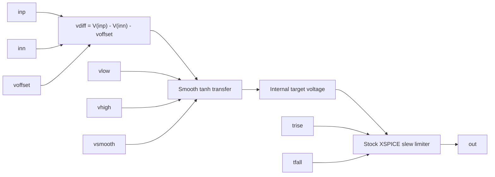
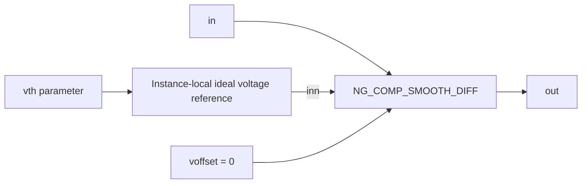

# Smooth Analog Comparators

This guide covers the two analog smooth-comparator wrappers in
`lib/ngfuncs.lib`:

- `NG_COMP_SMOOTH_DIFF inp inn out`
- `NG_COMP_SMOOTH_SE in out`

Both wrappers produce a continuous analog voltage. They do not create a
digital node or a hard switching event. A behavioral `tanh` expression
calculates a smooth target voltage, then ngspice's stock XSPICE `slew` model
limits how quickly the output can follow that target.

These wrappers use only stock ngspice facilities. Loading `ngfuncs.cm` is not
required when a netlist uses only the smooth comparators.

## Differential Comparator

Interface:

```spice
NG_COMP_SMOOTH_DIFF inp inn out
+ params: vlow=0 vhigh=1 voffset=0 vsmooth=1m trise=1n tfall=1n
```

### Ports

| Port | Direction | Description |
| --- | --- | --- |
| `inp` | Input | Non-inverting analog voltage input. Increasing this voltage drives the output toward `vhigh`. |
| `inn` | Input | Inverting analog voltage input. Increasing this voltage drives the output toward `vlow`. |
| `out` | Output | Continuous analog output voltage, bounded by the smooth target rails and rate-limited in time. |

### Signal Flow



The first stage is stateless. It maps the differential input to a target
between `vlow` and `vhigh`:

```text
vdiff = V(inp) - V(inn) - voffset

target = vlow + (vhigh-vlow)/2
         * (1 + tanh(2.197224577 * vdiff / vsmooth))
```

The constant `2.197224577` is `2*atanh(0.8)`. Consequently:

| Differential input | Target output |
| --- | --- |
| `vdiff = -vsmooth/2` | 10% of the span from `vlow` to `vhigh` |
| `vdiff = 0` | 50% of the output span |
| `vdiff = +vsmooth/2` | 90% of the output span |

Large negative and positive overdrive make the target approach `vlow` and
`vhigh`, respectively. Since `tanh` approaches its limits asymptotically, the
mathematical target remains continuous near the rails.

The second stage is stateful. It converts the configured full-scale 10-90%
times into slew rates:

```text
rise_slope = 0.8 * (vhigh-vlow) / trise
fall_slope = 0.8 * (vhigh-vlow) / tfall
```

For a sufficiently fast full-scale target transition, `out` therefore takes
approximately `trise` to travel from 10% to 90%, and `tfall` to travel from
90% to 10%.

## Single-Ended Comparator

Interface:

```spice
NG_COMP_SMOOTH_SE in out
+ params: vth=0 vlow=0 vhigh=1 vsmooth=1m trise=1n tfall=1n
```

### Ports

| Port | Direction | Description |
| --- | --- | --- |
| `in` | Input | Analog voltage compared with the configured threshold `vth`. |
| `out` | Output | Continuous analog output voltage with the same smooth transfer and slew behavior as the differential wrapper. |

### Signal Flow



The wrapper creates an internal ideal voltage source at `vth`, then delegates
to the differential comparator:

```text
inp = V(in)
inn = vth
voffset = 0
```

Its effective differential input is therefore:

```text
vdiff = V(in) - vth
```

The target reaches 50% of the output span when `V(in) = vth`. The 10% and 90%
target points occur at `V(in) = vth-vsmooth/2` and
`V(in) = vth+vsmooth/2`.

The internal reference node and nested comparator names are scoped to each
subcircuit instance, so multiple single-ended comparators may use different
thresholds in the same circuit.

## Parameters

| Parameter | Wrapper | Default | Units | Description |
| --- | --- | --- | --- | --- |
| `vlow` | Both | `0` | V | Low output rail approached under negative input overdrive. |
| `vhigh` | Both | `1` | V | High output rail approached under positive input overdrive. |
| `voffset` | Differential | `0` | V | Voltage subtracted from `V(inp)-V(inn)`. A positive value moves the 50% crossing to `V(inp)-V(inn)=voffset`. |
| `vth` | Single-ended | `0` | V | Internal reference voltage. The 50% crossing occurs when `V(in)=vth`. |
| `vsmooth` | Both | `1m` | V | Input-voltage distance between the static 10% and 90% target points. |
| `trise` | Both | `1n` | s | Full-scale output 10-90% rise time used to configure the slew limiter. |
| `tfall` | Both | `1n` | s | Full-scale output 90-10% fall time used to configure the slew limiter. |

Required constraints:

- `vsmooth > 0`
- `trise > 0`
- `tfall > 0`
- `vhigh > vlow`

Invalid combinations are unsupported and are not silently corrected.
Propagation delay and hysteresis are not supported in this version.

## Choosing Parameters

### Output rails

Set `vlow` and `vhigh` to the analog levels expected by the next circuit
stage. They do not have to represent logic levels; for example, `vlow=-1` and
`vhigh=1` produce a bipolar output.

### Smoothing width

`vsmooth` controls input sensitivity around the crossing:

- A smaller value produces a sharper transition and greater small-signal gain
  near the crossing.
- A larger value produces a wider, gentler transfer and makes small input
  noise cause smaller output changes.

`vsmooth` is not hysteresis. The output follows the same continuous curve in
both input directions.

### Rise and fall times

`trise` and `tfall` may be different. Use them to model asymmetric source or
sink behavior. Choose a transient maximum timestep substantially smaller than
the shortest configured transition time. A practical starting point is:

```text
maximum timestep <= min(trise, tfall) / 20
```

This is a simulation-resolution recommendation, not a wrapper requirement.

### Initial and transient behavior

During the operating-point solution and at the initial transient point, the
stock slew stage initializes `out` to the current smooth target. Slew limiting
applies to subsequent changes. This means the wrappers model finite transition
time, but do not add a separate propagation delay.

## Example 1: PWM from a Duty Command and Sawtooth

This circuit compares a fixed `0.35 V` duty-control voltage with a
`0 V`-to-`1 V` sawtooth. The sawtooth period is `100 us`, corresponding to
`10 kHz`.

```spice
Smooth finite-slew PWM comparator example

.include lib/ngfuncs.lib

* A 0.35 V duty command compared with a 0-to-1 V, 10 kHz sawtooth.
Vduty duty 0 dc 0.35
Vramp ramp 0 pulse(0 1 0 100u 1n 1n 100u)

Xpwm duty ramp pwm NG_COMP_SMOOTH_DIFF params:
+ vlow=0 vhigh=1 vsmooth=2m trise=1u tfall=1u

Rduty duty 0 1G
Rramp ramp 0 1G
Rpwm pwm 0 1G

.tran 0.1u 400u

.control
run
plot v(duty) v(ramp) v(pwm)
.endc

.end
```

Signal interpretation:

1. `Vduty` drives `inp`, while the sawtooth drives `inn`.
2. At the beginning of each cycle, `V(ramp) < V(duty)`, so the target is near
   `vhigh`.
3. The falling crossing occurs when the sawtooth reaches approximately
   `0.35 V`.
4. Since the sawtooth rises linearly from `0 V` to `1 V`, the high target
   occupies approximately 35% of each cycle.
5. `vsmooth=2m` makes the static 10-90% crossing span `2 mV` of ramp voltage.
6. `trise=1u` and `tfall=1u` prevent instantaneous output edges.

The output duty interval is based on the comparator crossing, while the exact
time spent above a chosen output-voltage level also includes the finite slew
transition. The complete runnable circuit is
[`examples/smooth_pwm.cir`](../examples/smooth_pwm.cir).

## Example 2: Single-Ended Threshold Detector

This example detects whether an analog input is above or below `1.25 V`. The
input steps between `1.23 V` and `1.27 V`, which provides substantial
overdrive relative to `vsmooth=1 mV`.

```spice
Smooth single-ended threshold detector example

.include lib/ngfuncs.lib

Vin in 0 pwl(
+ 0       1.23
+ 0.2m    1.23
+ 0.200001m 1.27
+ 0.6m    1.27
+ 0.600001m 1.23
+ 1m      1.23)

Xdetect in detected NG_COMP_SMOOTH_SE params:
+ vth=1.25 vlow=0 vhigh=1 vsmooth=1m trise=80u tfall=200u

Rin in 0 1G
Rout detected 0 1G

.tran 0.5u 1m

.control
run
plot v(in) v(detected)
.endc

.end
```

Signal interpretation:

1. The wrapper creates an internal `1.25 V` reference from `vth`.
2. While `V(in)=1.23 V`, the input is `20 mV` below the threshold and the
   target is effectively `0 V`.
3. At approximately `0.2 ms`, the input moves to `1.27 V`; the target moves
   toward `1 V`.
4. The output requires approximately `80 us` to travel from `0.1 V` to
   `0.9 V`.
5. At approximately `0.6 ms`, the input returns below the threshold.
6. The output requires approximately `200 us` to travel from `0.9 V` to
   `0.1 V`, demonstrating asymmetric rise and fall behavior.

The same behavior could be constructed explicitly with
`NG_COMP_SMOOTH_DIFF` by connecting `inp` to `in`, connecting `inn` to an
external `1.25 V` source, and setting `voffset=0`. The single-ended wrapper
packages that reference internally. The complete runnable circuit is
[`examples/smooth_threshold.cir`](../examples/smooth_threshold.cir).

## Limitations

- There is no explicit propagation-delay parameter.
- There is no hysteresis or memory in the static transfer.
- Invalid parameter combinations are unsupported.
- Very small `vsmooth`, `trise`, or `tfall` values may require tighter
  transient timestep control and increase simulation cost.
- The output is analog and should not be connected as an XSPICE digital node.

