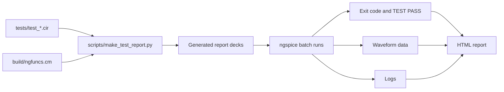
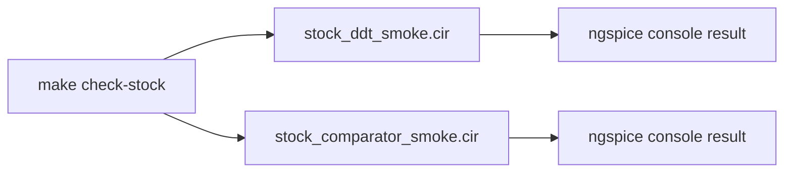

# Validation guide

## Test suites

The project has two separate validation paths:

| Command | Scope | Output |
| --- | --- | --- |
| `make test` or `make test-report` | `tests/test_*.cir`; public wrappers including custom models | HTML report under `tests/output/report/` |
| `make check-stock` | Raw stock `d_dt` and public comparator wrapper using only stock facilities | Console pass/fail |

`tests/stock_ddt_smoke.cir` tests raw stock `d_dt`, not the `NG_DDT` wrapper;
direct wrapper coverage comes from `tests/test_derivative.cir`.
`tests/stock_comparator_smoke.cir` tests the public
`NG_COMP_SMOOTH_DIFF` wrapper using only stock ngspice facilities.

## Regression report flow



The report generator currently omits a deck from the rendered denominator if
instrumentation or execution raises an exception before a `TestResult` is
created. Always compare the number of report logs with the number of source
decks.

## Stock smoke flow



## Coverage summary

- Directly tested: all public wrappers.
- Strongest coverage: `NG_COMP_SMOOTH_DIFF`.
- Current regression focus: nominal transient behavior.
- Generated report files are artifacts and are ignored by Git.

## Required validation commands

```sh
git diff --check
make check-stock
NGFUNCS_CM=build/ngfuncs.cm scripts/run_ngspice_tests.sh
make test-report
```

Then verify report completeness:

```sh
expected=$(find tests -maxdepth 1 -name 'test_*.cir' | wc -l)
actual=$(find tests/output/report/logs -maxdepth 1 -name 'test_*.log' | wc -l)
test "$actual" -eq "$expected"
```

Batch-run examples:

```sh
for deck in examples/*.cir; do
    ngspice -b "$deck"
done
```

Interactive `plot` commands are ignored in batch mode; that warning alone is
not a failure.

## Remaining validation gaps

- Trigger hysteresis and initial-high trigger state
- Negative input, nonzero `ic`, multi-wrap overshoot, and clamp interaction for
  the modulo integrator
- `NG_DDT` offset, limit smoothing, non-unit or negative gain, and AC behavior
- Invalid comparator parameter combinations
- Reset `ic` outside output limits
- Numerical consequences of custom hard clamps retaining a nonzero integration
  partial
